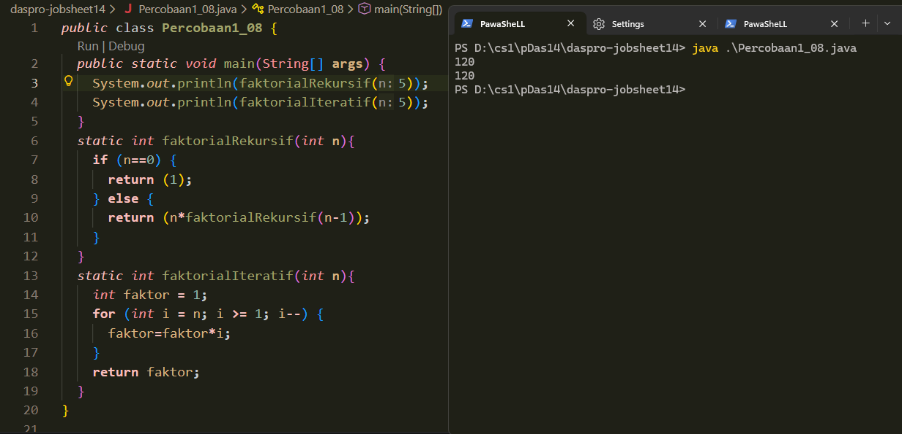
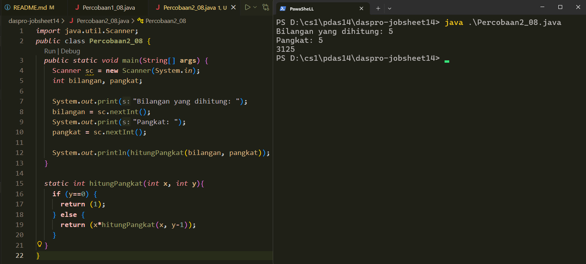
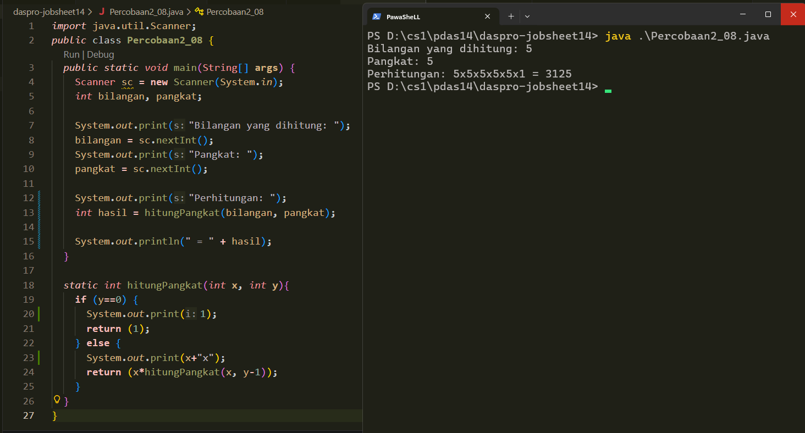
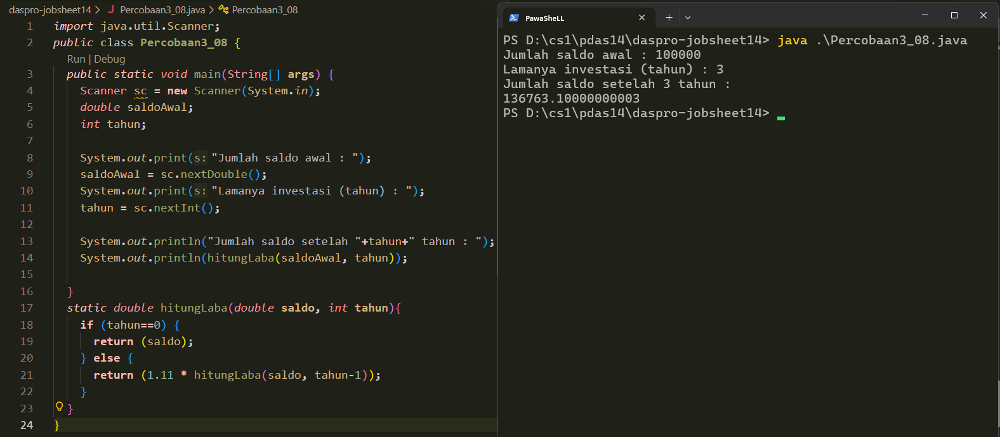

  # [Tugas](#tugas-1)  
  # [Daftar_Percobaan](#daftar_percobaan-1)  

# TUGAS
  
### TUGAS 1    
Soal : 
Buatlah program yang mengimplementasikan fungsi rekursif dan fungsi iteratif untuk menghitung dan mencetak total nilai, dengan input N → 1 + 2 + 3 + 4 + 5 + ... + ... + N. Contoh: 
```
Masukkan jumlah angka yang ingin dihitung (N): 4
Masukkan angka ke-4: 100
Masukkan angka ke-3: 80
Masukkan angka ke-2: 75
Masukkan angka ke-1: 65
Total dari 4 angka yang dimasukkan adalah: 320
```  
---  


# Daftar_Percobaan
1. [Percobaan 1](#percobaan-1)
- [Pertanyaan](#pertanyaan)
    * [Jawaban](#jawaban)
2. [Percobaan 2](#percobaan-2)
- [Pertanyaan](#pertanyaan-1)
    * [Jawaban](#jawaban-1)
3. [Percobaan 3](#percobaan-3)
- [Pertanyaan](#pertanyaan-2)
    * [Jawaban](#jawaban-2)


---

## Percobaan 1
[Percobaan1_08.java](/Percobaan1_08.java)  
Screenshot Inisial :  
  
  
  [Kembali ke #Daftar_Percobaan](#daftar_percobaan-1)

### Pertanyaan
1. Apa yang dimaksud dengan fungsi rekursif? 
2. Pada Percobaan1, apakah hasil yang diberikan fungsi `faktorialRekursif()` dan fungsi `faktorialIteratif()` sama? Jelaskan perbedaan alur jalannya program pada penggunaan fungsi rekursif dan fungsi iteratif! 
   
  
[Kembali ke #Daftar_Percobaan](#daftar_percobaan-1)

### Jawaban
1. Fungsi rekursif adalah fungsi yang di dalam prosesnya memanggil dirinya sendiri lagi. Pemanggilan ini dilakukan dengan cara mengubah nilai parameter sedemikian rupa agar mendekati dan sampai kondisi dasar/kondisi berhenti (base case). Tanpa base case, fungsi rekursif akan memanggil dirinya sendiri terus menerus (infinite recusrsion) dan menyebabkan error (stack overflow).  
  
2. Ya, hasil dari faktorialRekursif(5) dan faktorialIteratif(5) adalah sama, yaitu 120.  
Perbedaannya ada pada alur jalannya program:  
.
Fungsi rekursif (`faktorialRekursif`)  
Program berjalan dengan cara memanggil fungsi berulang-ulang.  
Contohnya:  
`faktorialRekursif(5)` dipanggil, lalu di dalamnya dipanggil fungsi `5 * faktorialRekursif(4)`, lalu  `4 * faktorialRekursif(3)`, dan seterusnya sampai `faktorialRekursif(0)`.
Setelah mencapai kondisi dasar, hasil dikembalikan satu per satu ke pemanggil sebelumnya sampai menghasilkan nilai akhir.
```
faktorialRekursif(1) = 1 × 1 = 1
faktorialRekursif(2) = 2 × 1 = 2
faktorialRekursif(3) = 3 × 2 = 6
faktorialRekursif(4) = 4 × 6 = 24
faktorialRekursif(5) = 5 × 24 = 120
```
.  
Fungsi iteratif (`faktorialIteratif`)  
Program berjalan menggunakan perulangan for tanpa pemanggilan fungsi berulang. Nilai faktorial dihitung langsung dengan mengalikan variabel faktor dari n sampai 1 dalam satu alur.  
Loop for berjalan dari 5 hingga 1, mengupdate variabel:  
```
Iterasi 1: faktor = 1 × 5 = 5
Iterasi 2: faktor = 5 × 4 = 20
Iterasi 3: faktor = 20 × 3 = 60
Iterasi 4: faktor = 60 × 2 = 120
Iterasi 5: faktor = 120 × 1 = 120
```
Return: Nilai faktor (120) dikembalikan
  

  [Kembali ke #Daftar_Percobaan](#daftar_percobaan-1)

---

## Percobaan 2
[Kondisi Awal Percobaan2_08.java | Commit (8fc26d7)](https://github.com/okeokke/daspro-jobsheet14/commit/8fc26d7b38541b0603f5d8d6958b02c8377b18ac)  
Screenshot Inisial:  
  
  
  [Kembali ke #Daftar_Percobaan](#daftar_percobaan-1)

### Pertanyaan
1. Pada Percobaan2, terdapat pemanggilan fungsi rekursif `hitungPangkat(bilangan, pangkat)` pada fungsi main, kemudian dilakukan pemanggilan fungsi `hitungPangkat()` secara berulangkali. Jelaskan sampai kapan proses pemanggilan fungsi tersebut akan dijalankan!  
2. Tambahkan  kode  program  untuk  mencetak  deret  perhitungan  pangkatnya.  Contoh: `hitungPangkat(2,5)` dicetak `2x2x2x2x2x1 = 32`
  
  
  [Kembali ke #Daftar_Percobaan](#daftar_percobaan-1)

### Jawaban
1. fungsi `hitungPangkat()` akan terus dipanggil sampai kondisi dasar (base case) dicapai, yaitu ketika parameter y (pangkat) sama dengan 0.
```
hitungPangkat(2, 5)
 memanggil hitungPangkat(2, 4)
  memanggil hitungPangkat(2, 3)
   memanggil hitungPangkat(2, 2)
    memanggil hitungPangkat(2, 1)
     memanggil hitungPangkat(2, 0)
      BASE CASE: y == 0, return 1 tanpa pemanggilan lanjut
```
Pada hitungPangkat(2, 0), fungsi tidak dipanggil lagi melainkan langsung mengembalikan nilai 1 karena sudah mencapai base case. Setelah itu, hasil dari setiap pemanggilan sebelumnya dikembalikan ke pemanggilnya (proses unwinding) hingga diperoleh hasil akhir.

2. [Percobaan2_08.java](/Percobaan2_08.java)  
  

  
  [Kembali ke #Daftar_Percobaan](#daftar_percobaan-1)

---

## Percobaan 3  
[Percobaan3_08.java](/Percobaan3_08.java)  
Screenshot Inisial :  
  
  
  [Kembali ke #Daftar_Percobaan](#daftar_percobaan-1)

### Pertanyaan
1. Pada Percobaan3, sebutkan blok kode program manakah yang merupakan “base case” dan “recursion call”! 
2. Jabarkan trace fase ekspansi dan fase subtitusi algoritma  perhitungan laba di atas jika diberikan nilai `hitungLaba(100000,3)`

  [Kembali ke #Daftar_Percobaan](#daftar_percobaan-1)

### Jawaban
1. .  (keduanya di dalam fungsi hitungPangkat)  
Base Case `(tahun==0)`  
```
...
  if (tahun==0) {
      return (saldo);
    }
    ...
```  
.    
Recursion Call (`return (x*hitungPangkat(x, y-1));`)
```
...
  else {
      return (x*hitungPangkat(x, y-1));
    }
    ...
```
2. .  
fase ekspansi (pemanggilan sampai di base case)
```
hitungLaba(100000, 3)
-> 1.11 * hitungLaba(100000, 2)

hitungLaba(100000, 2)
-> 1.11 * hitungLaba(100000, 1)

hitungLaba(100000, 1)
-> 1.11 * hitungLaba(100000, 0)

hitungLaba(100000, 0)
-> return 100000   (base case tercapai)
```
setelah ini, memasuki ke fase substitusi  
  
  
fase substitusi (return nilai)
```
hitungLaba(100000, 0)
= 100000

hitungLaba(100000, 1)
= 1.11 × 100000
= 111000

hitungLaba(100000, 2)
= 1.11 × 111000
= 123210

hitungLaba(100000, 3)
= 1.11 × 123210
= 136763.1
```
hasil akhir = 136763.1
  
  [Kembali ke #Daftar_Percobaan](#daftar_percobaan-1)

---
